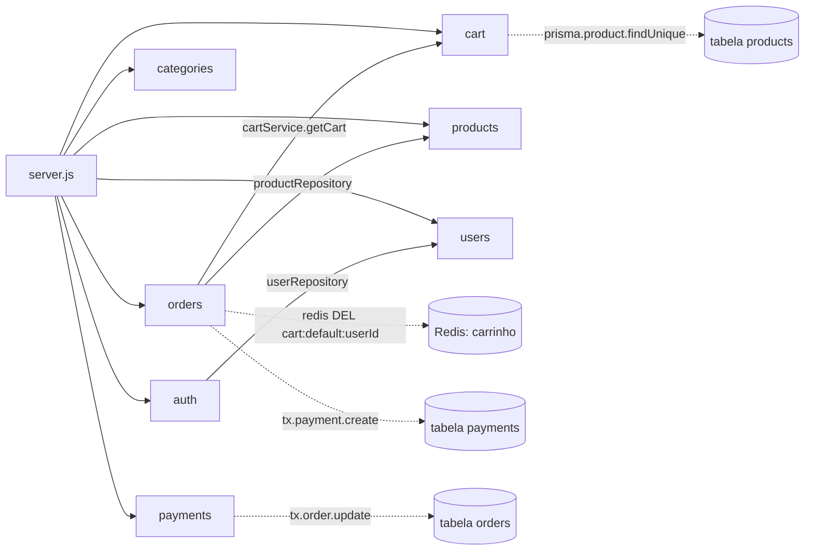

# Arquitetura do Sistema

> **Status:** documento oficial de referência (Spec Driven Development)
> **Base analisada:** branch `main`, commit `b99a0b2` · análise de 2026-09-28
> **Escopo:** todo o código em `src/`, `prisma/`, `package.json`, `Dockerfile`, `docker-compose.yml`, `prisma.config.ts`
> **Documentos relacionados:** [Objetivo do Sistema](./OBJETIVO_DO_SISTEMA.md) · READMEs locais de cada módulo (ver §12)

Convenção deste documento:
- Tudo o que está descrito foi verificado no código-fonte, com arquivo e linha quando relevante.
- Trechos marcados **Hipótese** são inferências (intenção do autor, evolução planejada) e **não** são comportamento existente.
- Débitos e riscos têm um identificador (`SEC-xx`, `ARQ-xx`, `DAD-xx`, `OPS-xx`) e esse mesmo ID aparece nos READMEs dos módulos. Ao corrigir um débito, atualize os dois lugares.

---

## 1. Visão arquitetural

A aplicação é uma **API REST monolítica e modular** de e-commerce, escrita em Node.js (CommonJS) com Express 5.

| Camada / tecnologia | Uso | Onde |
|---|---|---|
| Node.js 20 (imagem `node:20-alpine`) | Runtime | `Dockerfile` |
| Express `^5.2.1` | Servidor HTTP e roteamento | `src/server.js` |
| Prisma `^7.1.0` + `@prisma/adapter-pg` + `pg` | ORM e acesso ao PostgreSQL | `src/config/database.js`, `prisma/` |
| PostgreSQL 15 | Persistência principal | `docker-compose.yml` |
| Redis 7 (cliente `redis ^5`) | Carrinho, cache de listagem de produtos, refresh tokens | `src/config/redis.js` |
| jsonwebtoken + bcrypt | Autenticação (JWT) e hash de senha | `src/utils/token.js`, `src/modules/auth` |
| express-validator | Validação de payload (só no módulo `auth`) | `src/modules/auth/authValidators.js` |
| winston + morgan | Logs de aplicação e HTTP | `src/config/logger.js`, `src/middlewares/httpLogger.js` |
| helmet, cors, compression | Hardening e performance HTTP | `src/server.js` |

### 1.1 Estrutura de pastas

```
src/
├── server.js            # composição da aplicação (middlewares globais + rotas)
├── config/              # singletons de infraestrutura: prisma, redis, logger
├── middlewares/         # auth, validação, erro, logging
├── utils/               # AppError, funções JWT
└── modules/             # um diretório por domínio de negócio
    ├── auth/  cart/  categories/  orders/  payments/  products/  users/
prisma/
├── schema.prisma        # modelo de dados (fonte da verdade do banco)
└── migrations/          # migração única: 20260929025231_migrate
```

### 1.2 Diagrama de dependências entre módulos



Linhas cheias = import de outro módulo. Linhas tracejadas = acesso direto a dados que pertencem a outro módulo, sem passar pela API dele (ver `ARQ-01` a `ARQ-04`).

---

## 2. Padrões utilizados

| Padrão | Como está implementado |
|---|---|
| **Modular por domínio** | Cada domínio em `src/modules/<dominio>/` com arquivos `<x>Routes.js`, `<x>Controller.js`, `<x>Service.js` e, quando há persistência própria, `<x>Repository.js`. |
| **Camadas Routes → Controller → Service → Repository** | Rotas declaram middlewares e handlers; controllers extraem dados de `req` e formatam a resposta; services têm regras de negócio; repositories encapsulam o Prisma. |
| **Objetos literais como "classes" de serviço** | Controllers, services e repositories são objetos com métodos `async` exportados como singleton (`module.exports = xService`). Não há injeção de dependência: dependências vêm por `require`. |
| **Singletons de infraestrutura** | `prisma` (`config/database.js`), `redisClient` (`config/redis.js`), `logger` (`config/logger.js`) são instanciados no primeiro `require`. |
| **Erro operacional tipado** | `AppError(message, statusCode, code, details)` lançado pelos services; convertido em JSON por `errorHandler`. |
| **Tratamento de erro centralizado** | Controllers usam `try/catch` + `next(error)`; `errorHandler` é o último middleware em `server.js`. |
| **Cache-aside** | `productService.listProducts` lê do Redis e grava o resultado com TTL de 60 s. |
| **Transação de banco** | `prisma.$transaction` no checkout (`orderRepository.createOrderTransaction`) e na confirmação/cancelamento de pagamento (`paymentService`). |
| **Snapshot de preço** | `OrderItem.price` recebe o preço do produto no momento do checkout (`orderService.checkout`). |
| **Eventos de domínio simulados** | Apenas `logger.info("Evento Emitido: order.created ...")` e `order.paid`. Não há broker nem listeners. |

---

## 3. Regras arquiteturais

Regras que o código **já segue** e que devem ser mantidas, e regras que **passam a valer** a partir deste documento (marcadas como *Diretriz*).

1. **R1 — Um módulo por domínio.** Todo endpoint novo pertence a um diretório em `src/modules/`. O roteador do módulo é montado em `server.js` sob `/api/v1/<dominio>`.
2. **R2 — Fluxo de camadas unidirecional.** Routes → Controller → Service → Repository → Prisma. Controllers não chamam Prisma nem Redis. *(Hoje respeitado pelos controllers.)*
3. **R3 — Services lançam `AppError`; controllers não montam JSON de erro.** *(Violado em `cartController` e `userController.getProfile`, ver `ARQ-08`.)*
4. **R4 — Acesso a dados de outro módulo só pela API pública (service) desse módulo.** *Diretriz.* Hoje há 4 violações (`ARQ-01` a `ARQ-04`).
5. **R5 — Infraestrutura só por `src/config/`.** Nenhum módulo cria cliente próprio de Prisma, Redis ou logger. *(Respeitado.)*
6. **R6 — Todo endpoint que recebe body tem validator (`express-validator`) + `validateRequest`.** *Diretriz.* Hoje só `auth` segue (`SEC-04`).
7. **R7 — Autorização por papel via middleware compartilhado.** *Diretriz.* Hoje `adminOnly` está duplicado localmente (`ARQ-06`).
8. **R8 — Operações que alteram mais de uma tabela usam `prisma.$transaction`.** *(Respeitado no checkout e nos pagamentos.)*
9. **R9 — Nenhum segredo no código.** Configuração por variáveis de ambiente (`dotenv`). *(Respeitado.)*

---

## 4. Convenções técnicas

### 4.1 Nomenclatura e código
- Arquivos em camelCase com prefixo do domínio no singular: `productService.js`, `categoryRoutes.js`. Exceção: diretórios estão no plural (`products/`, `categories/`) e `auth`/`cart` no singular.
- CommonJS (`require`/`module.exports`), `"type": "commonjs"`.
- Comentários e mensagens de erro em português.
- IDs são UUID gerados pelo Prisma (`@default(uuid())`).

### 4.2 Contrato HTTP
- Prefixo de versão: `/api/v1`.
- Autenticação: header `Authorization: Bearer <accessToken>`; o payload decodificado fica em `req.user = { sub, role, iat, exp }`.
- **Resposta de sucesso (predominante):** `{ "data": ... }`. Variações existentes:
  - `auth`: `{ data, meta: { timestamp } }`
  - `GET /products`: `{ data, pagination: { page, limit, totalItems, totalPages } }`
  - `POST /orders`: `{ data, message }`
  - `DELETE` de produto/categoria/usuário: `204` sem corpo.
- **Resposta de erro (padrão do `errorHandler`):**
  ```json
  { "error": { "code": "RESOURCE_NOT_FOUND", "message": "...", "details": {}, "stack": "(apenas NODE_ENV=development)" } }
  ```
- Códigos de erro usados: `UNAUTHORIZED` (401), `FORBIDDEN` (403), `RESOURCE_NOT_FOUND` (404), `CONFLICT` (409), `OUT_OF_STOCK` (409), `INVALID_PAYLOAD` (400), `INTERNAL_SERVER_ERROR` (500).

### 4.3 Chaves Redis
| Chave | Dono | TTL | Conteúdo |
|---|---|---|---|
| `refresh:<userId>` | auth | 7 dias (fixo) | refresh token JWT |
| `cart:<tenantId>:<userId>` | cart (e `orders` apaga) | 30 dias | JSON `{ items[], total }` |
| `products:list:<json-params>` | products | 60 s | resposta paginada da listagem |

### 4.4 Variáveis de ambiente
`DATABASE_URL`, `REDIS_HOST`, `REDIS_PORT`, `JWT_ACCESS_SECRET`, `JWT_ACCESS_EXPIRATION`, `JWT_REFRESH_SECRET`, `JWT_REFRESH_EXPIRATION`, `NODE_ENV`, `PORT`. O `docker-compose.yml` também aceita `DB_USER`, `DB_PASSWORD`, `DB_NAME` para o container do Postgres.

---

## 5. Separação de responsabilidades

| Módulo | Responsabilidade | Persistência própria | Endpoints |
|---|---|---|---|
| `auth` | Registro e login; emissão de access/refresh token | Redis `refresh:*` (usa tabela `users` via `users`) | `POST /auth/register`, `POST /auth/login` |
| `users` | Consulta, atualização e remoção de usuário | tabela `users` | `GET/PUT/DELETE /users/:id` (auth) |
| `categories` | CRUD de categorias hierárquicas | tabela `categories` | `GET /categories`, `GET /categories/:id` (público); `POST/PUT/DELETE` (admin) |
| `products` | CRUD e listagem paginada/filtrada/cacheada de produtos | tabela `products`, Redis `products:list:*` | `GET /products`, `GET /products/:id` (público); `POST/PUT/DELETE` (admin) |
| `cart` | Carrinho do usuário em Redis | Redis `cart:*` | `GET /cart`, `POST /cart/items`, `DELETE /cart/items/:itemId` (auth) |
| `orders` | Checkout (carrinho → pedido) e listagem de pedidos do usuário | tabelas `orders`, `order_items` | `GET /orders`, `POST /orders` (auth) |
| `payments` | Pagamento simulado: criar, confirmar, cancelar | tabela `payments` | `POST /payments`, `POST /payments/:id/confirm`, `POST /payments/:id/cancel` (auth) |

Infraestrutura transversal: `config/` (Prisma, Redis, logger), `middlewares/` (auth, validação, erro, log HTTP), `utils/` (`AppError`, JWT). Endpoint extra: `GET /health` (em `server.js`).

---

## 6. Fluxo de comunicação entre módulos

### 6.1 Pipeline de uma requisição
```
helmet → compression → cors → express.json → express.urlencoded → httpLogger (morgan→winston)
  → roteador do módulo [→ authMiddleware] [→ adminOnly] [→ validators → validateRequest]
  → controller → service → repository/prisma | redis
  → (erro) next(err) → errorHandler → JSON de erro
  → (rota inexistente) AppError 404 RESOURCE_NOT_FOUND
```

### 6.2 Fluxo principal de compra (ponta a ponta)
1. `POST /auth/register` ou `/auth/login` → `authService` → `userRepository` (+ bcrypt) → tokens JWT; refresh salvo em Redis.
2. `GET /products` → `productService.listProducts` → Redis (cache) ou `productRepository.findAll`.
3. `POST /cart/items {productId, quantity}` → `cartService.addItem` → lê produto no Postgres, valida estoque, grava carrinho no Redis.
4. `POST /orders` → `orderService.checkout`:
   1. `cartService.getCart(userId)` (Redis);
   2. para cada item, `productRepository.findById` → valida existência, estoque e `status === 'ACTIVE'` e fixa o preço;
   3. `orderRepository.createOrderTransaction` em **uma transação**: decrementa estoque, cria `Order` + `OrderItem[]` (status `PENDING`) e cria `Payment` (`AWAITING_CONFIRMATION`);
   4. apaga a chave `cart:default:<userId>` no Redis (**fora** da transação);
   5. registra em log "Evento Emitido: order.created".
5. `POST /payments/:id/confirm` (header `Idempotency-Key` obrigatório) → transação: `Payment.status = PAID` e `Order.status = PAID` → log "order.paid".
6. Alternativa: `POST /payments/:id/cancel` → transação: `Payment.status = CANCELED` e `Order.status = CANCELED`. **Estoque não é devolvido.**

### 6.3 Dependências entre módulos (tabela)
| Origem | Destino | Tipo | Motivo | Avaliação |
|---|---|---|---|---|
| `auth/authService` | `users/userRepository` | import | buscar/criar usuário | Aceitável, mas pula `userService` (ARQ-05) |
| `orders/orderService` | `cart/cartService` | import | ler carrinho | OK (via service) |
| `orders/orderService` | `products/productRepository` | import | validar produto e preço | Violação R4 (ARQ-03) |
| `orders/orderService` | Redis `cart:default:*` | acesso direto | limpar carrinho | Violação R4, chave duplicada (ARQ-03) |
| `orders/orderRepository` | tabela `payments` | escrita direta | criar stub de pagamento | Violação R4 (ARQ-02) |
| `payments/paymentService` | tabela `orders` | escrita direta | atualizar status do pedido | Violação R4 (ARQ-01) |
| `cart/cartService` | tabela `products` | leitura direta via `prisma` | validar estoque | Violação R2/R4 (ARQ-04) |
| todos os módulos | `utils/AppError`, `config/*`, `middlewares/*` | import | infraestrutura | OK |

Não há dependência circular. `users`, `categories` e `products` não dependem de nenhum outro módulo de domínio.

---

## 7. Modelo de dados (resumo)

Fonte: `prisma/schema.prisma` e migração `20260929025231_migrate`.

| Entidade (tabela) | Campos-chave | Relações / restrições |
|---|---|---|
| `User` (`users`) | `email` único, `role` (`USER`/`ADMIN`), `tenantId` = `"default"` | 1‑N `Order` (FK `RESTRICT`) |
| `Category` (`categories`) | `parentId` opcional | auto-relação; FK `ON DELETE SET NULL`; 1‑N `Product` (FK `RESTRICT`) |
| `Product` (`products`) | `sku` único, `price Decimal(10,2)`, `stock Int`, `status` (`ACTIVE`/`INACTIVE`), `tenantId` | índice em `name`; N‑1 `Category`; 1‑N `OrderItem` (FK `RESTRICT`) |
| `Order` (`orders`) | `status` (`PENDING`/`PAID`/`CANCELED`), `totalValue Decimal(10,2)`, `tenantId` | N‑1 `User`; 1‑N `OrderItem`; 1‑1 `Payment` |
| `OrderItem` (`order_items`) | `quantity`, `price` (snapshot) | N‑1 `Order`, N‑1 `Product` |
| `Payment` (`payments`) | `orderId` único, `status` **String** (default `AWAITING_CONFIRMATION`), `externalId` opcional | 1‑1 `Order` |

---

## 8. Dependências críticas

| Dependência | Criticidade | Impacto se indisponível / alterada |
|---|---|---|
| **PostgreSQL** | Alta | Toda a API, exceto `/health` e leitura de carrinho. |
| **Redis** | Alta | Login/registro falham (gravação do refresh token não tem fallback); carrinho inteiro; checkout. Listagem de produtos tolera falha na **leitura** do cache, mas não na **gravação** (DAD-01). A conexão é aberta no `require` sem `catch` (OPS-01). |
| **Prisma 7** (`@prisma/client`, `@prisma/adapter-pg`, `prisma.config.ts`) | Alta | Prisma 7 exige o adapter e a URL fora do `schema.prisma`; atualizar versão exige revisar `config/database.js` e `prisma.config.ts`. |
| **Express 5** | Média | Express 5 repassa ao `errorHandler` erros lançados de forma síncrona em middlewares (usado por `authMiddleware` e `validateRequest`). Voltar ao Express 4 quebraria esse comportamento. |
| **jsonwebtoken / segredos JWT** | Alta | Troca de `JWT_ACCESS_SECRET` invalida todas as sessões. |
| **bcrypt** (nativo) | Média | Precisa compilar/baixar binário na imagem Alpine. |

Dependências declaradas **sem uso efetivo**: `swagger-ui-express` e `yamljs` (importados em `server.js`, só usados em código comentado), `uuid` (não importado). `jest` e `supertest` estão instalados, mas não existem testes (OPS-04, OPS-05).

---

## 9. Riscos técnicos, acoplamentos e violações

### 9.1 Segurança
| ID | Severidade | Descrição | Local |
|---|---|---|---|
| **SEC-01** | **Crítica** | **Escalada de privilégio no registro:** `register` aceita `role` do body e o repassa (`role: role \|\| 'USER'`). Qualquer pessoa pode criar conta `ADMIN`. | `auth/authService.js:9,22` |
| **SEC-02** | **Crítica** | **Pagamentos sem verificação de dono:** qualquer usuário autenticado pode criar, confirmar (marcar como `PAID`) ou cancelar o pagamento de qualquer pedido. | `payments/paymentService.js` |
| **SEC-03** | Alta | `PUT /users/:id` repassa o body direto ao Prisma: `password` é gravado **em texto puro**; também aceita `email`, `tenantId` e outros campos. | `users/userService.js:27-30` |
| **SEC-04** | Alta | Não há validação de payload em `products`, `categories`, `cart`, `users`, `payments`; bodies vão direto para o Prisma (mass assignment, ex.: `tenantId`, `id`). | services dos módulos citados |
| **SEC-05** | Média | Tokens: não há endpoint de refresh/logout; `verifyRefreshToken` não é usado; o refresh token salvo no Redis nunca é lido; o access token continua válido após excluir o usuário; `authMiddleware` não confere o esquema `Bearer`. | `utils/token.js`, `middlewares/authMiddleware.js` |
| **SEC-06** | Média | `cors()` sem restrição de origem; sem rate limiting (login sujeito a força bruta). | `server.js:31` |
| **SEC-07** | Média | `Idempotency-Key` é obrigatório, mas não é armazenado nem comparado; a "idempotência" é só `if status === 'PAID'`. | `payments/paymentService.js:18-30` |

### 9.2 Arquitetura e acoplamento
| ID | Descrição | Local |
|---|---|---|
| **ARQ-01** | `paymentService` altera a tabela `orders` direto via `prisma` (o próprio comentário reconhece). Acoplamento de escrita entre `payments` e `orders`. | `payments/paymentService.js:2,39,65` |
| **ARQ-02** | `orderRepository` cria registro em `payments` dentro da transação do checkout. O dono da tabela `payments` não controla sua criação. | `orders/orderRepository.js:53` |
| **ARQ-03** | `orderService` usa o repository de `products` e apaga a chave `cart:default:<userId>` direto no Redis (com `require` dentro da função), duplicando o formato da chave do `cartService` e fixando o tenant `default`. | `orders/orderService.js:3,57-58` |
| **ARQ-04** | `cartService` consulta `prisma.product` direto: sem repository e fora do próprio domínio. | `cart/cartService.js:2,19` |
| **ARQ-05** | `authService` usa `userRepository` diretamente em vez de `userService` (as regras de usuário ficam em dois lugares). | `auth/authService.js:2` |
| **ARQ-06** | Middleware `adminOnly` duplicado em `productRoutes` e `categoryRoutes`. Não há middleware de autorização compartilhado. | `products/productRoutes.js:8`, `categories/categoryRoutes.js:8` |
| **ARQ-07** | A autenticação é aplicada de formas diferentes: em `server.js` para `cart` e via `router.use` nos demais. A autorização de `users` está no controller (`getProfile`) e no service (`update`/`delete`). Rotas sob `/products` e `/categories` que não existem, fora de `GET`, respondem 401 em vez de 404 (o `router.use(authMiddleware)` roda antes do 404). | `server.js:50`, `users/*` |
| **ARQ-08** | Envelope de resposta inconsistente: `cartController` responde `{ error: 'UserId required' }`, `userController` responde `{ error: { message: 'Forbidden' } }` sem passar pelo `errorHandler`; formatos de sucesso variam (§4.2). | controllers citados |
| **ARQ-09** | Multi-tenancy só declarado: há `tenantId` em `users`, `products` e `orders`, mas nenhuma consulta filtra por ele; o carrinho usa `'default'` fixo. | schema, services |
| **ARQ-10** | "Eventos" `order.created`/`order.paid` são apenas `logger.info`. Com `NODE_ENV` diferente de `development`, o nível do logger é `warn` e essas linhas **não são registradas**. Comentário "Webhook: category.updated -> Simulado" não tem implementação. | `orderService.js:61`, `paymentService.js:47`, `config/logger.js:14`, `categoryService.js:21` |

### 9.3 Consistência de dados e confiabilidade
| ID | Descrição | Local |
|---|---|---|
| **DAD-01** | Cache de `GET /products` nunca é invalidado em create/update/delete (dados podem ficar desatualizados por até 60 s). O `redisClient.set` do cache está fora do `try/catch`: se o Redis cair, a listagem falha mesmo com o banco disponível. | `products/productService.js:43-81` |
| **DAD-02** | No checkout, o carrinho é limpo **depois** da transação. Se o `DEL` no Redis falhar, o pedido já existe, a API responde 500 e o carrinho permanece, abrindo caminho para pedido duplicado. Não há idempotência no `POST /orders`. As consultas de produto são N+1 (uma por item). | `orders/orderService.js` |
| **DAD-03** | Cancelar não devolve estoque; é possível cancelar um pagamento já `PAID` e confirmar um já `CANCELED` (não há máquina de estados). | `payments/paymentService.js` |
| **DAD-04** | `Payment.status` é `String` livre (`AWAITING_CONFIRMATION`/`PAID`/`CANCELED`), enquanto `Order.status` é enum. | `prisma/schema.prisma` |
| **DAD-05** | Valores monetários convertidos para `Number` (ponto flutuante) no carrinho e no total do pedido. | `cartService.js:45,51`, `orderService.js:38-40` |
| **DAD-06** | Erros do Prisma sem tratamento viram 500: excluir produto com `order_items` (P2003); excluir categoria ou usuário inexistente (P2025); `email` duplicado no update (P2002); categoria com `parentId` inválido; pagamento com `orderId` inexistente; excluir usuário com pedidos. | services |
| **DAD-07** | Carrinho sem validação: `quantity` pode chegar como string (`"2"`) e `+=` concatena (`"22"`); aceita valores negativos ou zero; não confere `status` do produto; o preço no carrinho pode ficar defasado (o checkout recalcula). | `cart/cartService.js` |
| **DAD-08** | Ao excluir uma categoria com filhas, a FK `SET NULL` as promove a raiz sem aviso. `GET /categories` retorna todas as categorias (raízes e filhas) com um nível de `children`, então as filhas aparecem duas vezes. | `categories/*`, migração |
| **DAD-09** | TTL do refresh token no Redis fixo em 7 dias, independente de `JWT_REFRESH_EXPIRATION`. | `auth/authService.js:30,50` |
| **DAD-10** | `limit` de `GET /products` sem teto (`?limit=100000`). | `products/productService.js:45` |

### 9.4 Operação e manutenção
| ID | Descrição | Local |
|---|---|---|
| **OPS-01** | O Redis conecta no `require` por uma IIFE `async` sem `catch` (rejeição não tratada se falhar). `/health` não verifica DB nem Redis. Não há graceful shutdown. | `config/redis.js:12-16`, `server.js:43` |
| **OPS-02** | `colorize` é aplicado também aos arquivos de log (códigos ANSI visíveis em `logs/all.log`); o caminho `logs/` é relativo ao diretório de execução; `productService` usa `console.error` em vez do logger. | `config/logger.js`, `productService.js:58` |
| **OPS-03** | `docker-compose`: o healthcheck do Postgres fixa `admin`/`api_ecommerce` e ignora `DB_USER`/`DB_NAME`. O serviço `api` recebe `DATABASE_URL`/`REDIS_HOST` do `.env`, que hoje apontam para `localhost`; dentro do container isso não alcança os serviços `postgres`/`redis` (seria preciso usar os hostnames `postgres` e `redis`). O Dockerfile usa `npm install` (não `npm ci`) e inclui devDependencies. | `docker-compose.yml`, `Dockerfile` |
| **OPS-04** | Não há testes: `npm test` sai com erro. Testes unitários de `cartService` existiram (`tests/unit/modules/cart/cartService.spec.js`) e foram removidos no commit `a9d5718`. **Hipótese:** as mensagens de commit citam "coupon behavior", o que sugere uma funcionalidade de cupom planejada, mas não há nada de cupom no código atual. | histórico git |
| **OPS-05** | Código e dependências órfãos: `middlewares/requestLogger.js` (nunca importado), `utils/token.verifyRefreshToken`, `userRepository.findAll`, `paymentRepository.updateStatus`, imports não usados em `server.js` (`swaggerUi`, `YAML`, `path`), dependência `uuid`. O `.gitignore` cita `/src/generated/prisma`, que não é gerado (o generator usa o output padrão). | vários |
| **OPS-06** | Não existe `.env.example`; o README traz credenciais de exemplo. | raiz |

### 9.5 Módulos e artefatos órfãos
- `src/middlewares/requestLogger.js`: nunca importado (substituído na prática por `httpLogger`).
- `utils/token.verifyRefreshToken` e a chave Redis `refresh:*`: gravados, nunca lidos.
- `userRepository.findAll`: sem endpoint de listagem de usuários.
- `paymentRepository.updateStatus`: o service atualiza via `prisma.$transaction`.
- Configuração Swagger comentada; o arquivo `swagger.yaml` não existe.

---

## 10. Diretrizes para futuras implementações

Ordem sugerida de prioridade; cada item fecha débitos catalogados.

1. **Segurança antes de funcionalidade:** remover `role` do registro (SEC-01); verificar dono em pagamentos (SEC-02); criar `changePassword` com hash e lista de campos permitidos no update de usuário (SEC-03).
2. **Validação obrigatória (R6):** criar `<dominio>Validators.js` em cada módulo que recebe body/params, seguindo o padrão de `auth`. Usar `toInt()` e `isInt({ min: 1 })` para `quantity`, `isUUID()` para IDs e `isDecimal` para preço.
3. **Autorização centralizada (R7):** criar `middlewares/authorize.js` (`authorize('ADMIN')`) e remover as cópias de `adminOnly`.
4. **Fronteiras de módulo (R4):**
   - `cartService` passa a expor `clearCart(userId, tenantId)`; `orderService` deixa de manipular Redis.
   - `productService` passa a expor `getAvailableProduct(id)` / `decrementStock(tx, …)`; `cart` e `orders` param de acessar Prisma/repository de produtos.
   - `paymentService` passa a expor `createForOrder(tx, orderId)`; `orderService` expõe `markAsPaid/markAsCanceled(tx, orderId)`. As transações cruzadas recebem o `tx` como parâmetro.
5. **Contrato de resposta único:** sucesso `{ data, meta? }` e erro sempre via `AppError` → `errorHandler`.
6. **Máquina de estados de pedido/pagamento:** `PENDING → PAID | CANCELED`, sem transições a partir de estados finais; devolver estoque ao cancelar; converter `Payment.status` para enum (migração).
7. **Idempotência real:** persistir `Idempotency-Key` (Redis com TTL) em `confirm` e em `POST /orders`.
8. **Cache:** invalidar `products:list:*` em create/update/delete e tolerar falha no `set`.
9. **Erros Prisma:** mapear P2002→409, P2003→409, P2025→404 em um único lugar (ex.: `errorHandler` ou helper `mapPrismaError`).
10. **Testes:** todo novo service vem com teste unitário (Jest) e todo endpoint com teste de integração (Supertest sobre `module.exports = app`).
11. **Spec antes de código (SDD):** qualquer mudança de contrato atualiza primeiro o README do módulo (seção "Funcionalidades" / "Pontos de entrada") e, se afetar fluxos, este documento e o [Objetivo do Sistema](./OBJETIVO_DO_SISTEMA.md).
12. **Multi-tenancy:** decidir explicitamente entre implementar (propagar `tenantId` do token e filtrar em todas as queries) ou remover as colunas. **Hipótese:** a intenção é implementar, dados o comentário "Multi-tenancy simples" no schema e "Configurável por tenant futuramente" em `server.js`.

---

## 11. Como executar (referência rápida)
`npm install` → criar `.env` → `docker compose up -d postgres redis` → `npm run migrate` → `npm run dev` (nodemon) ou `npm start`. O app é exportado por `server.js` e só abre porta quando executado diretamente (`require.main === module`), o que permite testes com Supertest.

## 12. Índice da documentação local
| Pasta | README |
|---|---|
| `src/config` | [README](../src/config/README.md) |
| `src/middlewares` | [README](../src/middlewares/README.md) |
| `src/utils` | [README](../src/utils/README.md) |
| `src/modules` | [README (visão dos módulos)](../src/modules/README.md) |
| `src/modules/auth` | [README](../src/modules/auth/README.md) |
| `src/modules/users` | [README](../src/modules/users/README.md) |
| `src/modules/categories` | [README](../src/modules/categories/README.md) |
| `src/modules/products` | [README](../src/modules/products/README.md) |
| `src/modules/cart` | [README](../src/modules/cart/README.md) |
| `src/modules/orders` | [README](../src/modules/orders/README.md) |
| `src/modules/payments` | [README](../src/modules/payments/README.md) |
| `prisma` | [README](../prisma/README.md) |
